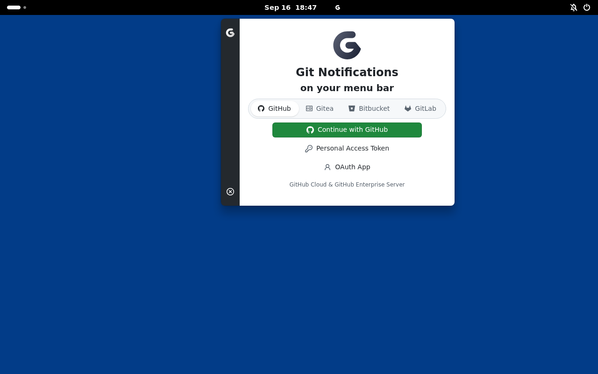

# Desktop validation

Run `pnpm test` for window placement, edge clamping, application matching, and
timer cleanup. These tests execute the extension source with mocked GNOME
imports. They do not prove that GNOME APIs or the AppIndicator integration work.

## Real compositor smoke test

On a GNOME Linux installation with Python 3, PyGObject, and GTK 4:

```shell
pnpm test:shell
```

The script creates temporary XDG directories and a separate D-Bus session,
packs and installs the extension zip, then loads it into a headless GNOME Wayland compositor with a 1280×800
virtual monitor, and opens a native GTK window whose application ID identifies
it as a Gitify test client. A test-only extension checks its final frame against
the primary work area. The script fails on incorrect coordinates, startup
failure, or a 45-second timeout. It does not modify your installed extensions.

On Ubuntu 24.04, install prerequisites with:

```shell
sudo apt-get install gnome-shell dbus-x11 python3-gi gir1.2-gtk-4.0
```

Alternatively, run the same GNOME compositor in a disposable container without
KVM or a host display:

```shell
docker build -f tests/shell/Dockerfile -t gitify-gnome-test .
docker run --rm gitify-gnome-test
```

The image starts its own system bus and uses GNOME's non-systemd login fallback.
It needs neither privileged mode nor the host's D-Bus socket.
CI runs this check on Ubuntu 24.04 with GNOME 46 and Ubuntu 26.04 with GNOME 50.
To build the latter locally, add `--build-arg GNOME_TEST_IMAGE=ubuntu:26.04`.

## Gitify tray test

In a disposable Ubuntu desktop with Gitify and
`gnome-shell-extension-appindicator` installed:

```shell
GITIFY_DESKTOP_TEST=1 GITIFY_TEST_SCREENSHOT=/tmp/gitify-desktop.png pnpm test:shell
```

This mode starts the installed Gitify binary with native Wayland, activates it
through AppIndicator's D-Bus path, and checks placement. It then moves the tray
icon to the panel's centre, requests a window-manager close, reopens Gitify,
and checks that it follows the moved icon before capturing the desktop. The
screenshot check requires at least eight bright pixels in the 16×16 region
around the tray icon's centre on the unscaled black test panel. This catches
a black-on-black icon even when its actor is marked visible. This
distinguishes tray anchoring from fallback corner placement. It requires Ubuntu's
`ubuntu-appindicators@ubuntu.com` extension. The launcher disables Electron's
sandbox for the disposable root-owned container; do not use this mode with a
personal Gitify profile. The temporary XDG configuration starts without accounts.

This tests the actual application, compositor and AppIndicator D-Bus path. It
does not simulate a physical mouse click. Check that gesture separately in a
visual session; AppIndicator 58 on Ubuntu 24.04 uses double-click activation.

Use a Gitify build containing the GNOME white-idle-icon fix. The published
7.8.0 binary fails the screenshot visibility check. In the Gitify checkout,
build an unpacked Linux app with `pnpm build` followed by
`pnpm exec electron-builder --linux dir --publish never`.

Then, from this extension checkout:

```shell
GITIFY_BUILD=/absolute/path/to/gitify/dist/linux-unpacked
docker build --build-arg GNOME_TEST_IMAGE=ubuntu:26.04 -f tests/shell/Dockerfile -t gitify-gnome-desktop .
docker run -d --name gitify-gnome-desktop gitify-gnome-desktop sleep infinity
docker cp "$GITIFY_BUILD" gitify-gnome-desktop:/opt/gitify-test
docker exec gitify-gnome-desktop ln -s /opt/gitify-test/gitify /usr/local/bin/gitify
docker exec gitify-gnome-desktop bash -c 'mkdir -p /run/dbus && dbus-daemon --system --fork'
docker exec -e GITIFY_DESKTOP_TEST=1 -e GITIFY_TEST_SCREENSHOT=/tmp/desktop.png gitify-gnome-desktop bash scripts/test-shell.sh
docker cp gitify-gnome-desktop:/tmp/desktop.png /tmp/gitify-gnome-desktop.png
docker rm -f gitify-gnome-desktop
```

### Results from 16 September 2026

- GNOME 46.0 / Mutter 46.2: native GTK placement passed. Gitify 7.8.0 opened at
  the expected coordinates, but reopening produced a zero-sized Meta window.
  The same zero-size failure reproduced with this extension disabled. Treat
  Gitify's native Wayland reopening on this version as unresolved.
- GNOME 50.1: native GTK placement and Gitify 7.8.0's tray activation,
  window-manager close, and reopen passed. After relocating the tray icon to
  the panel centre, Gitify reopened at `473,40` with its `500×400` frame intact.
- A locally packaged Gitify build with the GNOME icon fix passed the same
  sequence with a visible white G. The screenshot check found 52 bright pixels
  at the tray centre; the original screenshot had zero and failed the check.
- Both environments used software rendering and a 1280×800 virtual monitor.
  No physical GPU, graphical login manager, fractional scaling, or second
  monitor was exercised.

The screenshot below shows the locally built Gitify app after the second tray
activation on GNOME 50.1. The white G is visible next to the clock, above the
reopened window. The test moved the icon to the panel centre to verify anchoring.



## Visual VM checks before release

Use a disposable GNOME Wayland VM with a graphical login and a snapshot before
installation. Start with GNOME 46 and 50, then cover each advertised version
in `metadata.json` before claiming support. Record the actual Shell and
AppIndicator versions, Gitify build, display scale, and session type.

1. Install the built zip with `gnome-extensions install --force`, log out and
   back in, and enable `gitify@gitify.io`. Check the extension is active.
2. Open Gitify with its X11 backend disabled. Click its tray icon repeatedly.
   The window should stay below the icon after it finishes resizing.
3. Hide and immediately reopen Gitify. Quit it while placement is pending.
   Disable and re-enable the extension. Check Shell logs for extension errors.
4. Disable AppIndicator and open Gitify with its keyboard shortcut. The window
   should use the primary monitor's top-right work area. Re-enable AppIndicator.
5. Repeat at 100%, 150%, and 200% scale, with a small display, and after changing
   the primary monitor in a two-monitor setup. Check that the window remains
   accessible and that logical coordinates match the tray location.
6. Disable the Gitify extension and verify GNOME resumes normal placement.
   Enable Gitify's X11 backend and verify its existing tray positioning still works.
7. In the Gitify build containing the standalone integration, open System
   settings and follow “GNOME extension installation”. It should open the
   repository's installation instructions in the browser.

Capture screenshots and `journalctl --user -b` output around any failure.
A headless compositor pass does not establish visual correctness, installation
across login, fractional scaling, or compatibility with every supported Shell.
